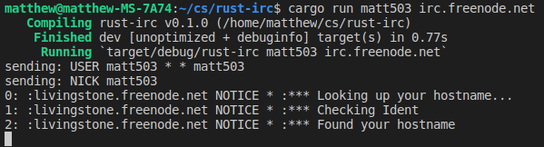
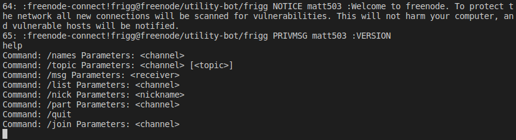

# rust-irc

Copyright (c) 2019 Matthew Geary

A simple IRC (Internet Relay Chat) Client written in Rust. 

## Build

In order to build, rustc should be installed with version 1.36 or greater.  
<https://www.rust-lang.org/tools/install>

`git clone git@github.com:mgear2/rust-irc.git`  
`cd rust-irc`  
`cargo build`  

## Run

`cargo run <username> <server>`

If a username is already taken, the server will refuse the connection and await a new nickname. A new nickname can be sent by the user with the command `/nick <username>`. 

## Test

Run `cargo test` to do some basic testing. 

## Usage

Once a connection is established, the following commands are available to a user:
* Command: help  
Function: lists commands available to the user 
* Command: /quit  
Function: sends a quit message to server and exits the client program
* Command: /join  
Parameters: [channel]  
Function: joins the specified channel, or creates it if it doesn't exist.
* Command: /part  
Parameters: [channel] 
Function: leaves the specified channel
* Command: /nick  
Parameters: [nickname] 
Function: changes user nickname to that specified
* Command: /msg  
Parameters: [receiver] 
Function: Sends a message to the receiver. The receiver can be a channel or a user. 
* Command: /topic  
Parameters: [channel] [topic]
Function: Used to set the given channel to the specified topic. 
* Command: /list  
Parameters: [channel]
Function: Lists channels and their topics. If the parameter is given, just that channel is displayed. 
* Command: /names  
Parameters: [channel]
Function: Lists users on the server. If the parameter is given, just users in that channel are displayed. 

## Examples

>Connecting to `irc.freenode.net` with nickname `matt503`

>Output of the `help` command after connecting to the server

## IRC

For an in-depth look at the IRC protocol, including descriptions of the above commands and how to implement them:  
<https://tools.ietf.org/html/rfc1459>

## Servers

To connect to freenode, use the below server:  
`irc.freenode.net`

More information about IRC Servers:  
<https://netsplit.de/>

## License

This program is licensed under the "MIT License".  Please
see the file `LICENSE` in the source distribution of this
software for license terms.
